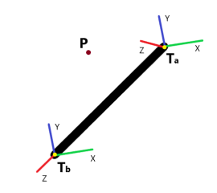
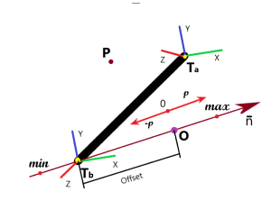
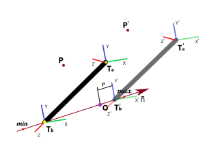
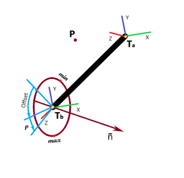
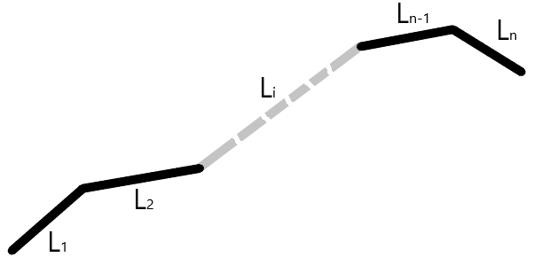

# Kinematic chains

## 1 Contents

#### 2. Kinematic chains
#####	2.1 Links 

		2.1.1 Static link 
		2.1.2 Linear joint
		2.1.3 Rotary joint

#####	2.2 Chains

		2.2.1 Simple chain
		2.2.2 Subchains

## 2 Kinematic chains
### 2.1 Links
#### 2.1.1 Static link

Static link is a link without any kinematic transformation attached.

This type of link is used to model machine immovable connections.

 
**T**a – attachment transformation in the link modelling coordinates. Used to attach child link(s).

**P** – point coordinates in the global coordinate space.

**P**b– point coordinates in the base coordinate space.

**P**a– point coordinates in the attachment coordinate space.

**T**l– link transformation. This is a transformation from **T**b to **T**a.

_Parameters_

_None._

_Constraints_

_None._

#### 2.1.2 Linear joint.

Linear joint is a dynamic link with attached linear transformation.

Linear transformation is transforming the base transformation **T**b and all associated geometries.

This type of link is used to model machine linear axes.

 

 – linear transformation axis.

_p_ – linear axis position.

**O** – position of the **T**b origin, when _p = 0_

_Offset_ – distance between **T**b origin and **O**. This is a machine control zero position.

**T**d– dynamic link transformation. This is a transformation defined by dynamic axis.

This transformation defines base coordinate system **T**b is transformed, when joint moves.

**T**b– base transformation in the link modelling coordinates. Used to align link model with attachment of the parent link.

**T&#39;**b– transformed base transformation.

where is a transformed link transformation of the previous link.

**T**a– attachment transformation in the link modelling coordinates. Used to attach child link(s).

**T&#39;**a– transformed attachment transformation.

**T**l– link transformation. This is a transformation from **T**b to **T**a.

**P** – point coordinates in the global coordinate space.

**P&#39;** – transformed point coordinates in the global coordinate space after link move.

**P**b– point coordinates in the base coordinate space.

**P&#39;**b– transformed point coordinates in the base coordinate space.

**P**a– point coordinates in the attachment coordinate space.

_Parameters_

_p_ – linear axis position.

_Constraints_

_**min**_ – minimal value of the parameter _p_.

_**max**_ – maximal value of the parameter _p_.

#### 2.1.3 Rotary joint.

Rotary joint is a dynamic link with attached rotary transformation.

Rotary transformation is transforming the base transformation **T**b and all associated geometries.

This type of link is used to model machine rotary axes such as robotic arms, driveshafts etc.

n – rotary transformation axis.

_p_ – rotary axis position.

_Offset_ – Defines machine control zero position. This is an angle to rotate link model, so it will be in the correct position, when _p = 0._ Quite often model of the link is done at the position, which is not a 0 for the control. So extra rotation of the model is required.

**T**d– dynamic link transformation. This is a transformation defined by dynamic axis.

where

**T**b– base transformation in the link modelling coordinates. Used to align link model with attachment of the parent link.

**T&#39;**b– transformed base transformation.

where is a transformed link transformation of the previous link.

**T**a– attachment transformation in the link modelling coordinates. Used to attach child link(s).

**T&#39;**a– transformed attachment transformation.

**T**l– link transformation. This is a transformation from **T**b to **T**a.

**P** – point coordinates in the global coordinate space.

**P&#39;** – transformed point coordinates in the global coordinate space.

**P**b– point coordinates in the base coordinate space.

**P&#39;**b– transformed point coordinates in the base coordinate space.

**P**a– point coordinates in the attachment coordinate space.

_Parameters_

_p_ – linear axis position.

_Constraints_

_**min**_ – minimal value of the parameter _p_.

_**max**_ – maximal value of the parameter _p_.

### 2.2_Chains_
#### 2.2.1 Simple chain

Simple chain is a kinematic chain where first link doesn&#39;t have a parent link and has exactly one child link. Last link has exactly one parent link and no child link. Intermediate links has exactly one parent link and one child link.

Simple chain examples are CNC machine tools and robots.

Links are assembled such a way, that base transformation of the link **L**i
is aligned with attachment transformation of the link **L**i-1
in the global coordinate space. For the first link **L**1
 base transformation specify position of the link in the global coordinate space.

Attachments are made using equations

From the equation (2.9) and we have

#### 2.2.2 Subchains

If some links are static or can be treated temporarily as static, then they can be combined into subchains, which can be treated as a single chain. For the 2 links relationship will be

Hence

or

From

we have

For more static links we can proceed recursively.