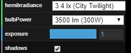
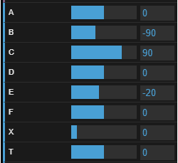
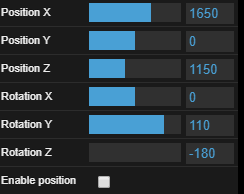
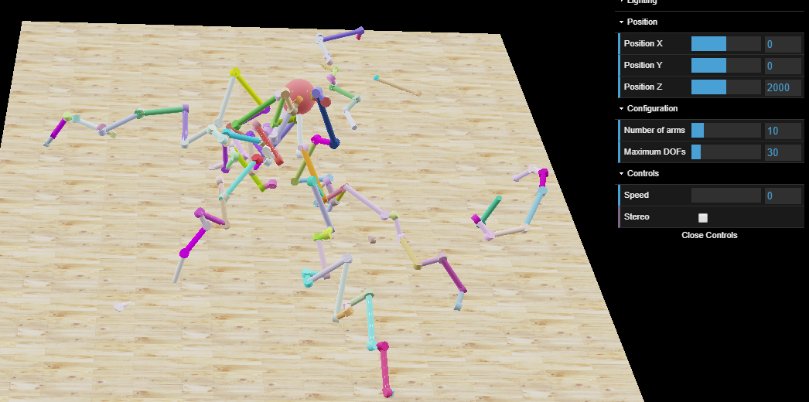
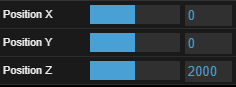
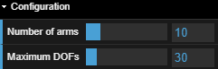
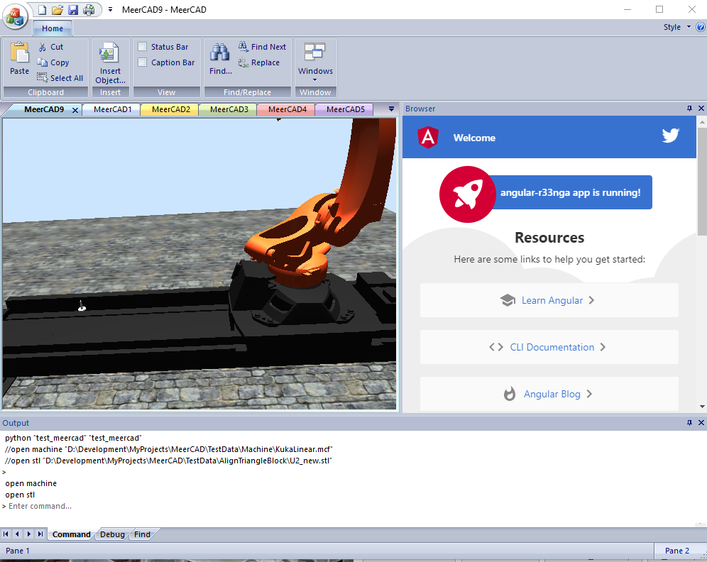

# RobotConfigurator

*Robot configuration editor.*

[Edit on StackBlitz ⚡️](https://stackblitz.com/github/VJigouline/RobotConfigurator)  
[Angular documentation](https://angular.io/docs)

This project was generated with [Angular CLI](https://github.com/angular/angular-cli) version 8.3.6.  
Project options: routing and [SCSS](https://sass-lang.com/documentation) as a style sheet.

## Additional modules

These modules should be added on top of the standard angular installation:

`npm install angular-split` [Documentation](https://bertrandg.github.io/angular-split/#/documentation)  
`npm install three` [Documentation](https://threejs.org/docs/#manual/en/introduction/Import-via-modules)  
`npm install angular-resize-event` [Documentation](https://www.npmjs.com/package/angular-resize-event)  
`ng add @angular/material` [Documentation](https://material.angular.io/guide/getting-started), accept _HammerJS_ option for the jesture recognition, accept browser animations.  
`npm install react-color` [Documentation](http://casesandberg.github.io/react-color/)

## Development server

Run `ng serve` for a dev server. Navigate to `http://localhost:4200/`. The app will automatically reload if you change any of the source files.

## Code scaffolding

Run `ng generate component component-name` to generate a new component. You can also use `ng generate directive|pipe|service|class|guard|interface|enum|module`.

## Build

Run `ng build` to build the project. The build artifacts will be stored in the `dist/` directory. Use the `--prod` flag for a production build.

## Running unit tests

Run `ng test` to execute the unit tests via [Karma](https://karma-runner.github.io).

## Running end-to-end tests

Run `ng e2e` to execute the end-to-end tests via [Protractor](http://www.protractortest.org/).

## Further help

To get more help on the Angular CLI use `ng help` or go check out the [Angular CLI README](https://github.com/angular/angular-cli/blob/master/README.md).

Example of the working ThreeJS application can be found at [https://www.meercad.com/Robots/robot.html](https://www.meercad.com/Robots/robot.html)

## Challenge

The ultimate task is to create configurable machine (aka robot) simulation software with fast inverse
solution.

Explanation of the controls of the live JavaScript prototype application for the
[Kuka](https://www.kuka.com) KR300 robot.

Lighting settings from the ThreeJS example.

KR300 forward solution controls. This is a simple bit. Forward controls are specifying positions of
the machine (robot) and the final position of the effector (used to perform useful action). Changing any
of the axis coordinate will move machine to the specified location,.. but how we will know, what axes
coordinates should be so effector will be in the required position?

This is a difficult part, which is called [Inverse kinematics](https://en.wikipedia.org/wiki/Inverse_kinematics).

The problem is that with arbitrary number of the axes there can be multiple inverse solutions. And
there can be a nasty problems like ... [**Singularities**](https://en.wikipedia.org/wiki/Robot_kinematics).

Those controls are for the Inverse Kinematics solution for the KR300 robot with the linear axis.

When *Enable position* checkbox is checked in, the robot effector will follow the coordinates and
the vector specified by those controls. Forward solution will be disabled in this case.

## Future

This is a [Random kinematic chain](https://www.meercad.com/Monster/Monster.html) prototype. JavaScript
and ThreeJS based live example to generate multiple *random* robots and provide Inverse
solution for them.

The robots are created using random value generator and they all follow the ball. The controls are:

Those set a position of the end effector, which robots should achieve..., *if they can*.

Contols to set maximum number of arms and maximum number of joints (actual values are randomly selected):

Shown number of arms is limited to 50 parallel arms and 200 degrees of freedom. JavaScript
can't do more. C++ implementation worked with more than 1000 degrees of freedom.

## Coming

This project is to provide an experimental interface for the C++ application with built-in Chromium
browser.

This last example is a bit messy. It is a work in progress. It shows C++ application, which can read
machine configuration, has built-in [Chromium browser](https://en.wikipedia.org/wiki/Chromium_Embedded_Framework)
with JavaScript interface, [Ogre3D](https://en.wikipedia.org/wiki/OGRE) as a graphics system,
command line interface (custom and Python) and Angular sample application running.

